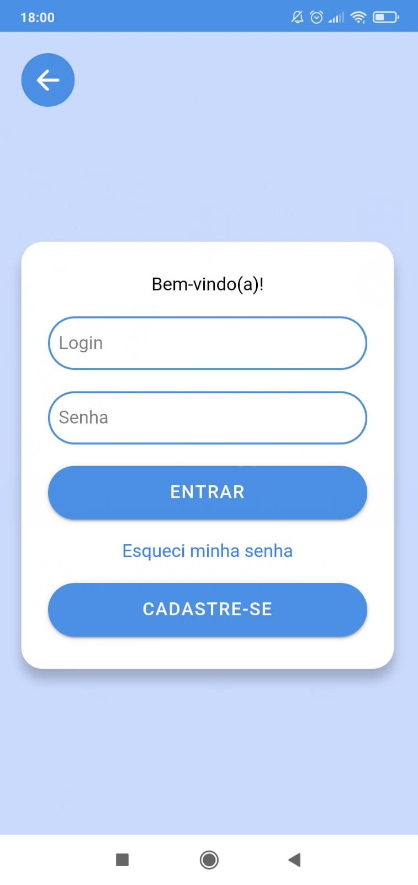
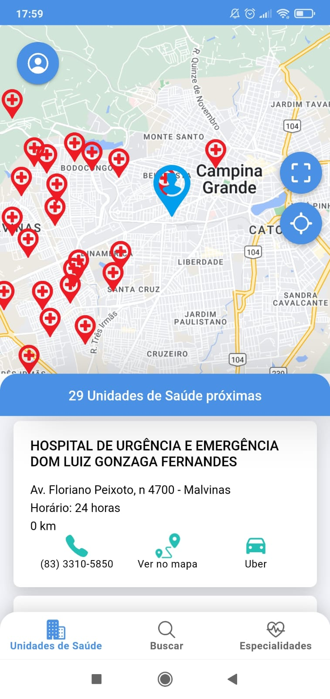
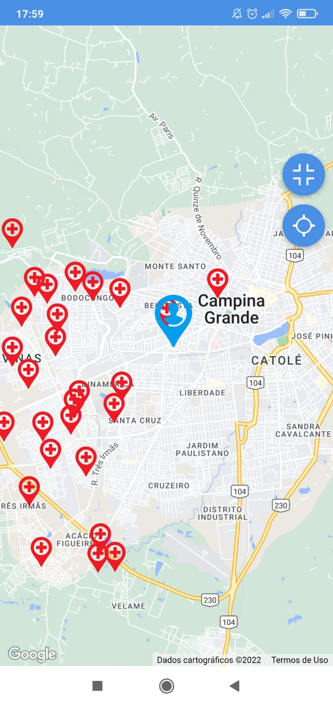
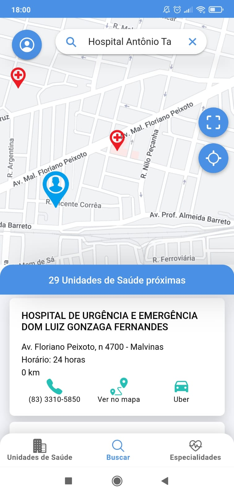
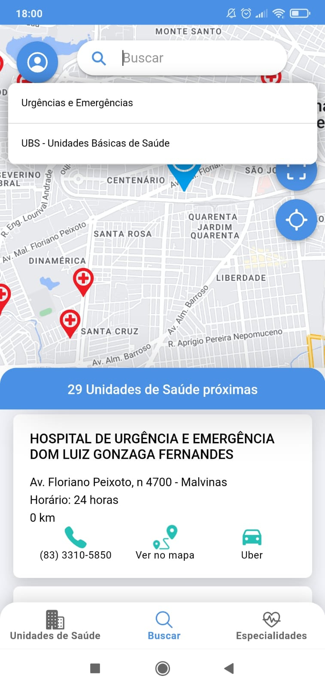
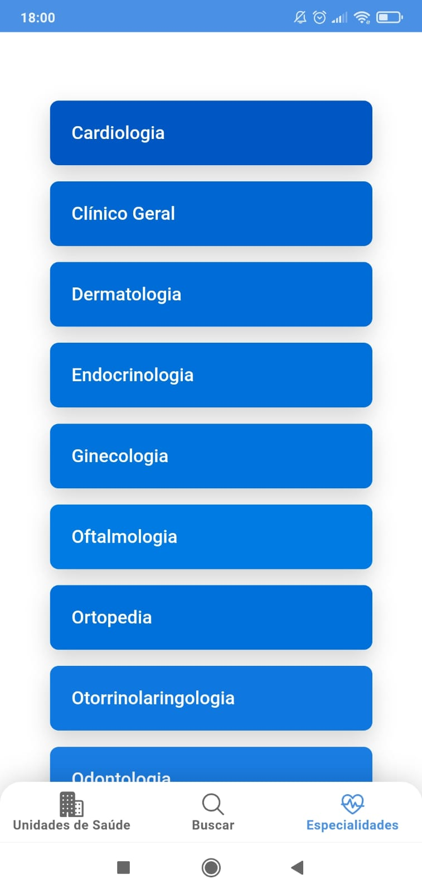
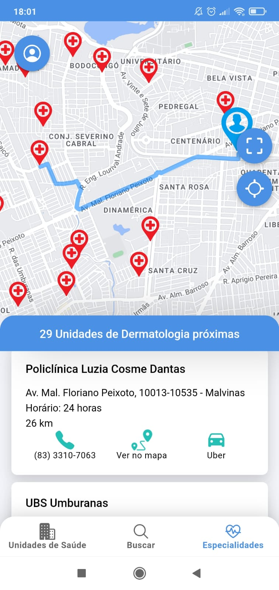

# Front end - app para buscar unidades de saúde.

Sistema desenvolvido para TCC II - UEPB - 2022.1.

Front end de uma aplicação Android/IOS para buscar unidades de saúde proximas ao usuário, desenvolvida utilizando Ionic5 + Angular. Para cadastrar as unidades de saúde na aplicação, foi desenvolvido um sistema web utilizando Angular.


Repositório do sistema web: https://github.com/Danieleventura/crud-sistema-web-TCC


## Primeiros passos:

1-Clone este repositório: git clone https://github.com/Danieleventura/app-servio-saude-TCC

2-Rode ```npm install``` no root do projeto.

3-Rode ```ionic serve``` ou ```ionic cordova run android``` em um terminal no root do projeto.


## Configuração google-map:

1- Informar sua ***google-map key*** no arquivo ***index.html*** .


 

  

  

  

